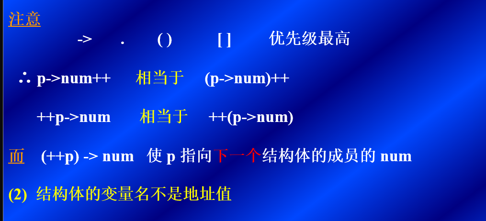

# 结构

## 定义

* 一个东西有多项特征，需要用几个数据共同描述

```C
struct student
{
    int num;
    char sex[4];
    int age;
    float score;
    char addr[30];
};
```

## 一.先声明结构体类型，再定义变量名

```c
struct student
struct student student1，student2;
/*定义了结构体类型名struct */
/*student1和2是结构体变量名*/
```

该类型结构体中所包含的域

```c
{
    int num;
    char sex[4];
    int age;
    float score;
    char addr[30];
};
```

## 二.在声明类型的同时定义变量

```c
 struct student
  { int   num;
    char  name[10];
    char  sex;
    int   age;
    float score;
    char  addr[30];
  } student1,student2;

```

同时定义了student1和student2

也可以

```c
struct student 
{ int num; 
  char  name[10]; 
  char  sex[4];
  int   age;
  float score;
  char  addr[30];
};/*定义了一个student类型的结构体变量*/
struct student student1,student2;
```

可以另起一行，重新定义结构体变量

**结构体类型的成员也可以单独使用，可以也是一个结构体变量**。

```c
struct date
   { int month;
     int day;
     int year;
    };//定义了一个data类型的struct类型*
struct student
   { int   num;
     char  name[20];
     char  sex;
     int   age;
     struct date birthday;//在这个struct data类型上我再定义一个叫birthday的变量
     char  addr[30];
   }; student1,student2;

```

## 结构体变量的引用

### 规则

* 不能整体输出，但是同类型的结构体变量可以相互赋值

```c
student1.num=10010;

//引用方式：结构体变量名.成员名

printf("%d,%d,%c",score); 
//不能这么干，会报错
```

* 结构体的嵌套只能对对低级的成员进行操作

```c
student1.birthday.month
student1.birthday.day
student1.birthday.year   

```

* 成员变量可以像变量一样计算

* 可以引用成员的地址（当然，也不能整体引用）

### 结构体变量的初始化

```c
struct student
  { long int  num;
    char  name[10];
    char  sex[4];
    char  addr[20];
  } a={ 89031,“李林”,“男”,“北京东路123号” };
  //定义了一个叫a的struct student类型的变量，并且进行赋值
```

按照顺序依次赋值于成员，数据类型和成员类型要一致

### 结构体数组

也就是一个数组，里面的每一个元素都是结构体变量

* 定义结构体数组

```c
struct student
  { int   num;
    char  name[20];
    char  sex;
    int   age;
    float score;
    char  addr[30]; 
  };
 
 strct student stu[3]; 
```

定义了一个数组，有三个元素，每一个都是结构化体

```c
stu[i].age    stu[i].score//引用方式
```

结构体数组的初始化，和多个数组的初始化类似

### 指针结构体类型数据的指针

结构体变量指针：结构体变量的首地址

指向结构体变量的指针：指针变量的值为结构体变量的首地址

* 指向结构体变量的指针

如何定义：

```c
struct student student1,*p;
p = &student1;
//此时，p存储了结构体变量的首地址，指针变量的值为结构体变量的首地址
```

* 指向结构体变量的指针对结构体的成员访问

(*p).num就可以访问student1结构体中num成员的数字

```c
printf ("学号: %ld\n姓名: %s\n性别: %s\n成绩: %5.1f\n",stu_1.num,stu_1.name,stu_1.sex,stu_1.score);

printf ("\n学号: %ld\n姓名: %s\n性别: %s\n成绩: %5.1f\n",(*p).num,(*p).name,(*p).sex,(*p).score);
//(*p).sex和直接写结构体的成员名称效果一样
//相当于是把student的首地址存储到p中，然后把p的地址解引用找到对应的元素，输出了元素
```

*注意*。

*1.不能用指向结构体的指针直接指向结构体成员*。

不能直接

```c
char *p;
p=&student.score
//两者的类型不一样，不能直接转换，如果类型一样是可以转换的，但是这样容易错用//

*p.num/*相当于*/*(p.num)
//表达的是一个成员的地址

(*p).num/*相当于*/student.num//表示一个结构体的元素
```

三种表达结构体变量的形式

* 结构体变量名.成员名
* (*p).成员名
* p->成员名


*2.结构体的变量名不是地址名*。

## 指向结构体数组的指针

指向结构体数组的指针：指针变量的值为结构体数组元素的首地址

```c
struct  student
  { int   num;
    char  name[10];
    char  sex[4];
    int   age; };
struct student stu[3]=
      {{ 10101,”李林”,“男”,18 },
       { 10102,“张福”,“男”,19 },
       { 10104,“王敏”,“女”,20 } };
main()
{ struct student *p;
  for(p=stu;p<stu+3;p++)    /* p的初值为stu的首地址*/
  printf("%d %s %s %d",p->num,p->name,p->sex,p->age);//p->age就是找到p地址对应的student结构然后找到里面的成员，之后还是要对应的%d%c%s类型
} 
/*struct student *p是定义一个stuct student为类型的地址，*p的初值是student的首地址。

p+1就是找到下一个数组的首地址*/
```

* struct student *p;之后
p=student

(++p)->num对应num成员的以一个数组的num，

* p只能指向一个结构体类型数据，不能指向成员

p=&stu[2].num(不能这么写，只能指向student这个结构体类型数据，只能指向student这个结构体，然后p->成员名/(*p).成员名这样写)

### 用结构体变量和指向结构体的指针作为函数参数

结构体与函数传递的方法

1. 用结构体变量的成员作实参
stu[1].num        stu[2].name

2. 用结构体变量作实参

3. 用指向结构体变量的指针作实参

```c

//打印学生的学号,姓名,成绩

#define  FORMAT "%d\n%s\n%f\n%f\n%f\n"
struct  student           /*外部类型*/
  { int   num;
    char  name[20];
    float score[3];
  }; stu={12345, “李莉”，67.5,89,78.6};
main()
{ 
    void print(struct student * ) /*  函数声明  */
    print ( &stu );      /* stu 的地址, &不能少 */
}

void print(struct student *p)
{
    printf(FORMAT,p->num,p->name,p->score[0],
    p->score[1],p->score[2]);
}

```

p->score[0],p->score[1],p->score[2]------>这些都是p->score这个结构体里面的数组中第012的元素
