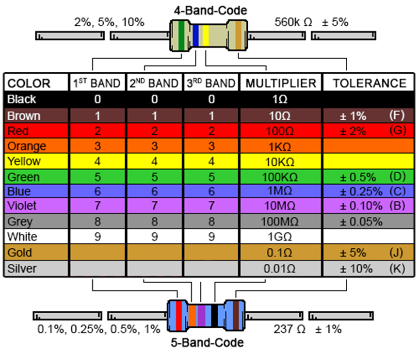
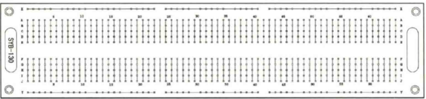
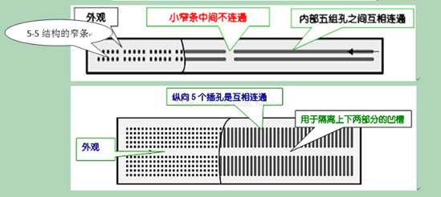
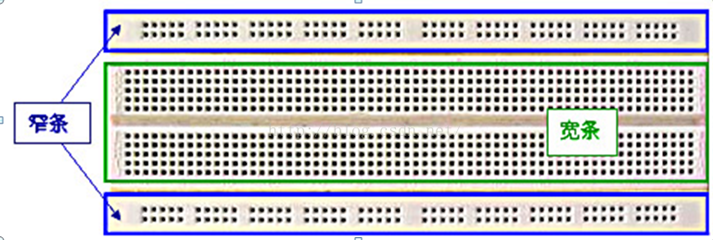
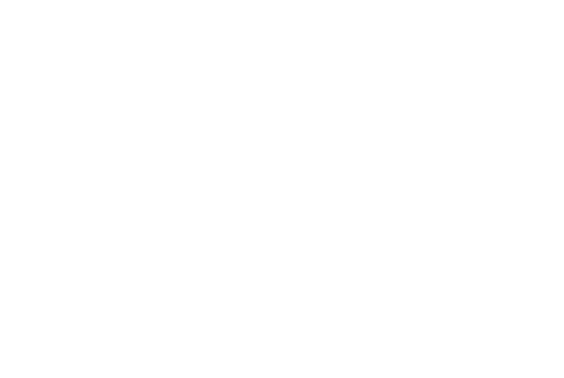

# aduino

## 面包板及其相应的电子元件

固定电阻；R

- 金属膜电阻（受温度影响小）
- 线绕电阻（精密，耐高温，功率大）
- 碳膜电阻（价格低，使用广）

### 固定电阻的参数:标称阻值：直标法，数标法，色环法

一.直标法
*R和K表示了小数点所在的位置*
如果只有三位数字的话，前两位是有效数字，第三位是指数（单位是欧姆）

最后一位如果是9不是9次方而是-1次方

二.色环电阻

四环电阻：前两位代表有效数字，第三位位倍率（乘数）第四位位允许偏差

五环电阻：前三环代表有效数字，第四环带biu奥i倍率，第五环位允许误差
*从左往右读*  

颜色对应的数字可以查看色环表

### 可变电阻的参数

可变电阻器：通过改变接入电路部分的电阻材料长度，实现改变阻值

符号VR或者R
按照材料分类为：碳膜式和缠绕式
按照结构分：旋转式（电位器）直滑式（滑动变阻器）
按照阻值分类：线性式，指数式，对数式

### 特殊电阻

热敏，光敏，压敏
组织受到特定的环境因素影响较大，部分可用作传感器。通常为非线性变化。

### 发光二极管

核心部分为PN结，由于电子和空穴直接复合而放出能量的结果
长脚为正极，短脚为负极

### 面包板：一种具有多孔插座的插件版

结构：拆带（上下电源区）宽带（中元器件区）
种类：无焊面包板，组合面包板，单面包板

使用技巧：元器件引脚或者导线头要沿面包板的版面垂直方向插入方孔，能感受到均匀地摩擦力，在面包板导致时，元器件可以被簧片夹住而不脱落

通常在宽条部分搭接电路的主体部分，上面的窄条取一排做电源的正极，下面的窄条取一排做电源的负极

### 电容器

几种电容器的表示方式

电容器的主要参数

标称容量：直标法，数标法，色标法

数标法：三位数，前两位数有效数字，末尾乘数，单位pf
两位数一个字母：容量单位为小数点位（字母表示的地方是小数点，同时这个字母代表的数字和f结合起来就是单位）

色标法：和电阻器色标法相同，只是单位是pf（不常见）

### 电感器

电感器是能把电能转化为磁场能存储的元件，结构类似于变压器，但是只有一个绕组

电感器具有一定的电源，能阻碍电流的变化，故称扼流器，电抗器，动态电抗器。

单位为H（pH mH）
电感器在电路中用L表示

分类也分为固定电感器和可调电感器

### 晶体三极管

也称为：双极型晶体管

是一种电流控制电流的半导体器件，作用是把微弱型号放大成幅度更大的电信号，也叫做电路开关

分类为锗管和硅管，其中N型半导体在高纯度硅中用磷原子取代一些硅原子，产生自由电子导电。P型则用硼取代硅，产生的空穴用于导电

三个级：基级B，集电极C，发射级E

分类：功率和频率（这方面尚待完善，可以去听一下b站其他的网课然后再回来学习）

## 555芯片

555芯片：一种集成电路芯片，可用作振荡器，脉冲发射器，延时发射器，多谐震荡器

主要由比较器，触发器，反相器，和3个5k欧姆电阻组成的分压器等部分组成

八个引脚

## 