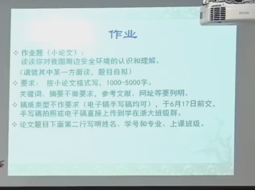

# 中国和作业

- 作业题（小论文）： 谈谈你对我国周边安全环境的认识和理
解。
 （请就其中某一方面谈，题目自拟）
- 要求： 按小论文格式写，1000-5000字。
  关键词、摘要不做要求，参考文献、网址等要列明。
- 稿纸类型不作要求（电子稿手写稿均可），于6月17日前交，
手写稿拍照或电子稿直接上传到学在浙大班级群。
- 论文题目下面第二行写明姓名、学号和专业、上课班级。

## 开始构思

- 按照中国的地域来排序（专注于一个地方）
- 然后每一个从海陆空火箭军来分析他国的军事水平和威胁
- 已经每个国家从历史和地理，国家视角

## 台海关系-----------东海资源竞争

“经济角度”来详细展开

题目：《东海资源竞争与区域经济安全：挑战与机遇》

摘要：
本文主要从经济角度详细分析我国东海周边海域在能源和海洋资源开发中的竞争现状，探讨这种竞争如何影响区域经济安全，并提出相应对策建议。通过对资源储量、开发成本、区域合作机制等方面的调研，本文力图提供一种立足于合作共赢的视角来审视东海安全形势下的经济问题。

一、引言
介绍东海区域的资源背景、经济战略意义以及当前的开发现状。

台海地区位于中国大陆和台湾岛之间，是连接东亚经济体最重要的海上通道之一，具有丰富的海洋生物资源、油气资源以及战略位置上的重要价值。

以下将从资源背景、经济战略意义以及当前开发现状三个方面进行详细的讲述：
一、资源背景台海拥有丰富的渔业资源，是世界著名的渔场之一，产量包含了多种经济鱼类，对于台湾和大陆沿海地区的渔业发展极为重要。此外，台海底下富含油气资源，虽然探测与开发的工作相较于其他海域较为滞后，但潜在的石油和天然气储量对于两岸的能源安全均具有战略意义。

二、经济战略意义台海作为西太平洋与东南亚之间的必经之路，对于区域乃至世界的航运和贸易具有至关重要的地位。海峡两岸及其周边地区经济的蓬勃发展，使台海成为了世界上船舶密集、货运量巨大的海域之一。此外，两岸都高度依赖对外贸易，使得其海上运输线的安全稳定至关重要。在全球能源格局中，台海地区的油气资源开发能为两岸提供更大的能源自主性与安全保障，有助于调整能源结构，减少对外部能源的依赖。

三、当前开发现状当前，台海地区的资源开发面临着诸多挑战。首先，海峡两岸尽管在经济交流与合作方面取得了进展，但政治因素仍然是制约资源开发和经济合作的一个重要因素。其次，在渔业资源的开发上，由于过度捕捞导致的资源枯竭风险逐年提高，两岸同样面临着资源管理与可持续发展的问题。对于油气资源而言，受技术、资本、环保等多方面因素的限制，其勘探与开发工作进展较为缓慢，并且在这一过程中可能涉及到的环境保护和生态平衡问题也是不能忽视的。

为了促进区域的稳定与繁荣，台海两岸及相关地区国家需要在充分沟通的基础上，开展合作，确保资源的合理开发与海上通道的安全。同时，也需要重视环保和生态平衡，以可持续的方式开发和利用海洋资源。
(以上仅为简述，具体开展此类研究时，还需详细。)

二、东海资源的经济价值分析各类数据、相关政策及两岸的政治经济关系等复杂因素
详细分析东海资源的组成，包括石油、天然气、渔业资源等，以及其对沿海国家的经济发展的重要性。

三、东海资源竞争现状
概述我国与周边国家在东海资源开发方面的主要竞争行为及其导致的经济冲突，包括渔业资源过度捕捞、能源资源的争夺和海域开发权的摩擦。

四、东海资源竞争对区域经济安全的影响
从宏观和微观两个层面审视资源竞争如何影响区域国家的经济安全，具体可以包括资源安全、能源供应链的稳定性、及其对国内产业影响。

五、现有合作机制及其挑战
评估现有的双边或多边合作机制，譬如中日韩自贸协定的讨论，以及这些机制在实际操作中遇到的挑战和限制。

六、未来发展趋势及对策建议
从东海资源共享、共同开发以及创建更有效的区域经济整合机制等方面，提出针对性的对策。重点推动东海成为“合作海”而非“竞争海”，强调区域安全和稳定对经济发展的重要性。

七、结语
总结东海资源对我国及东海周边国家经济的深远影响，并强调合作与对话在维护区域经济安全中的必要性。

本文提纲展示了如何从经济角度出发，详细探讨东海区域的安全环境，实际撰写需深入研究和分析相关数据和政策来充实内容。
