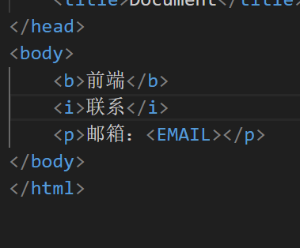

# HTML

*这篇笔记是《HTML5+CSS3+JavaScript从入门到精通》的读书笔记*。

## 基础

### html是什么

HTML：超文本标记语言。是由一些命令组成的描述性文字

标签：HTML标签是由尖括号包围的关键字，比如`<html>、<head>、<body>`等。标签的作用是向浏览器提供信息。
一般html标签是成对出现的，被组织的网页元素被放在首尾标签，中间是内容。

.html文件和.htm文件都是html格式文件的拓展名，即网页文件，是一种文本文件，里面的都是文本（图片和音频都是要后期插入的）

### 如何获取网页的源代码

空白处单击右键

### 静态网页

纯粹html格式的网页成为静态网页，文件内包含

* 文本
* 图片
* 音频
* 视频
* 客户端脚本
* java小程序
* ActivaX控件

没有后台数据库，不含程序，不可交互，更新比较麻烦，使用于更新较少的展示性网站

工作原理

* 输入url地址
* 浏览器查找ip地址
* 找到对应主机的ip地址之后，与对应主机的web服务器建立联系，请求网页文件
* 服务器返回网页文件给浏览器
* 浏览器解析网页文件，并显示内容

### 动态网页

页面代码不变但是显示内容发生改变，基本的HTML和ASP,PHP,JSP等语言，以及数据库编程等技术的融合，以期实现对网络内容和风格的高效动态和交互式的管理。

工作原理：

* 输入url地址
* 浏览器查找ip地址
* 找到对应主机的ip地址之后，与对应主机的web服务器建立联系，请求网页文件
* 服务器返回网页文件给浏览器
如果找到的是动态页面，则web服务器把动态文件交给相应的动态处理器。web服务器本身不处理动态页面文件
* 动态处理器将动态页面文件解释称html文件，并返回给web服务器，然后web服务器返回静态html文件给客户端浏览器
* 浏览器解析html文件，并显示内容

### 重要标签

* doctype：定义文档类型，告诉浏览器使用哪种规范来解析网页。

```html
<!DOCTYPE html>
```

HTML5中文档什么只有这一种
请始终添加这个生命，确保浏览器获知文档类型。

* `<html>`：定义HTML文档的根元素，所有的HTML元素都必须嵌套在这里。
告知浏览器这是一个HTML文件

```html
<html>
</html>
```

* `<head>`：包含网页的元信息，比如网页的标题、描述、关键字、作者、和其他元数据。**是所有元素的容器**
* `<title>`：定义网页的标题，显示在浏览器的标题栏或者标签页上。
* `<body>`：定义网页的主体内容，包含网页的主要信息。

## 文本和段落

### 文本

#### 换行

在HTML中，换行符是通过`<br>`标签实现的。

段落标签`<p>`也可以实现换行，但是要`<p>    </p>`这样把内容写在中间。一般的应用中，会在段落的文字后面加上一个`<p>`标签

#### 空格

&nbsp;可以用来表示空格

（Non-Breaking Space）：这个字符实体表示不会被折断的空格。它不会产生换行，因此在某些场景中很有用。例如，当两个单词需要连接在一起时，使用可以确保它们不会被分隔成两行。比如姓和名、金额数字等，这些不应该换行的情况。

#### 段落对齐

使用`<p align="center">`可以让段落居中显示。
align属性可以设置段落的对齐方式，可选值有left、right、center.

### 文本的属性样式

#### 字体大小

1. `<font size="5">`：设置字体大小为5号。
2. `<font size="+2">`：增加字体大小2号。
3. `<font size="-2">`：减小字体大小2号。

代码实现

```html
<!DOCTYPE html>
<html>
<head>
	<title>字体大小</title>
</head>
<body>
	<p><font size="5">这是一个字体大小为5号的段落。</font></p>
	<p><font size="+2">这是一个字体大小增加2号的段落。</font></p>
	<p><font size="-2">这是一个字体大小减小2号的段落。</font></p>
</body>
</html>
```

#### 特殊符号

1. `&copy;`：版权符号。
2. `&reg;`：注册商标符号。
3. `&trade;`：商标专用符号。
4. `&euro;`：欧元符号。
5. `&pound;`：英镑符号。
6. `&yen;`：日元符号。
7. `&cent;`：美元符号。
8. `&Delta;`：希腊字母Delta。
9. `&uarr;`：向上箭头。
10. `&darr;`：向下箭头。
11. `&larr;`：向左箭头。
12. `&rarr;`：向右箭头。
13. `&times;`：乘号。
14. `&divide;`：除号。
15. `&plusmn;`：正负号。
16. `&ne;`：不等于。
17. `&le;`：小于等于。
18. `&ge;`：大于等于。
19. `&lt;`：小于。
20. `&gt;`：大于。
21. `&amp;`：和号。
22. `&quot;`：引号。
23. `&nbsp;`：空格。
24. `&iexcl;`：感叹号。
25. `&emsp;`:一个空白位
26. `&ensp;`:半空白位
27. `&thinsp;`:细空白位


代码实现

```html
<!DOCTYPE html>
<html>
<head>
	<title>特殊符号</title>
</head>
<body>
	<p>版权符号：&copy;</p>
	<p>注册商标符号：&reg;</p>
	<p>商标专用符号：&trade;</p>
	<p>欧元符号：&euro;</p>
	<p>英镑符号：&pound;</p>
	<p>日元符号：&yen;</p>
	<p>美元符号：&cent;</p>
	<p>希腊字母Delta：&Delta;</p>
	<p>向上箭头：&uarr;</p>
	<p>向下箭头：&darr;</p>
	<p>向左箭头：&larr;</p>
	<p>向右箭头：&rarr;</p>
	<p>乘号：&times;</p>
	<p>除号：&divide;</p>
	<p>正负号：&plusmn;</p>
	<p>不等于：&ne;</p>
	<p>小于等于：&le;</p>
	<p>大于等于：&ge;</p>
	<p>小于：&lt;</p>
	<p>大于：&gt;</p>
	<p>和号：&amp;</p>
	<p>引号：&quot;</p>
	<p>空格：&nbsp;</p>
	<p>感叹号：&iexcl;</p>
	<p>一个空白位：&emsp;</p>
	<p>半空白位：&ensp;</p>
	<p>细空白位：&thinsp;</p>
</body>
</html>
```

*以后用的多了自然就记住了*。

#### 标注（html4）

```html
<acronym title="标注的解释">被标注的内容</acronym>
```

当鼠标移动到标注内容上的时候，会出现浮动层显示注解的内容

html5中不再支持，可以使用`<abbr>`标签代替。

```html
<abbr title="标注的解释">被标注的内容</abbr>
```

#### 列表

1. 无序列表：使用`<ol>`标签，并在`<li>`标签中添加内容。
列表的type属性有disc、circle（空心圆）、square三种，默认是disc。

```html
<ul type="circle">
	<li>第一项</li>
	<li>第二项</li>
	<li>第三项</li>
</ul>
```

2. 有序列表：使用`<ol>`标签，并在`<li>`标签中添加内容。
列表的type属性有1、A、a、I、i三种，默认是1。

```html
<ol type="A">
	<li>第一项</li>
	<li>第二项</li>
	<li>第三项</li>
</ol>
```

```

代码实现

```html
<!DOCTYPE html>
<html>
<head>
	<title>列表</title>
</head>
<body>
	<h2>有序列表</h2>
	<ol>
		<li>第一项</li>
		<li>第二项</li>
		<li>第三项</li>
	</ol>
	<h2>无序列表</h2>
	<ul>
		<li>第一项</li>
		<li>第二项</li>
		<li>第三项</li>
	</ul>
	<h2>自定义列表</h2>
	<dl>
		<dt>HTML</dt>
		<dd>超文本标记语言</dd>
		<dt>CSS</dt>

		<dd>层叠样式表</dd>
		<dt>JavaScript</dt>
		<dd>脚本语言</dd>
	</dl>
</body>
</html>
```

##### 定义列表

```html
<dl>
    <dt>HTML</dt>
    <dd>超文本标记语言</dd>
    <dt>CSS</dt>
    <dd>层叠样式表</dd>
    <dt>JavaScript</dt>
    <dd>脚本语言</dd>
</dl>
```

1. `<dl>`：定义定义列表。
2. `<dt>`：定义定义标题。
3. `<dd>`：定义定义描述。

#### 列表嵌套

不同列表直接可以互相嵌套使用

```html
<ul>
    <li>第一项</li>
    <li>第二项</li>    
    <li>第三项
        <ul>
            <li>第一项</li>
            <li>第二项</li>
            <li>第三项</li>
        </ul>
    </li>
</ul>
```

## 网页中的图像

### 图像基础

#### 常见的位图图像

位图图像：是指由像素组成的图像，每个像素都有自己的颜色值。

常见的位图图像格式有：BMP、GIF、JPEG、PNG、TIFF等。

* BMP：Windows系统的图像格式，支持24位色。保存图像不失真，不能压缩
* GIF：Graphics Interchange Format，支持256色。支持透明度，压缩，交错和多图像图片（动画gif）。不支持半透明
* JPEG：Joint Photographic Experts Group，压缩比高，色彩平滑，适合照片。手机拍摄的照片默认就是JPEG格式
* PNG：Portable Network Graphics，png-8支持256位色。支持透明度，压缩，支持半透明。压缩不失真

#### 常见的矢量图像

矢量图像：是指由线条、点、面组成的图像，没有颜色，只有线条的宽度和颜色。

常见的矢量图像格式有：EPS、SVG、AI、PDF等。

矢量图中的图形叫做对象，每个对象都是一个自成一体的实体，具有颜色，形状，大小，位置等属性。

只能靠软件生成，文件占用空间小，放大不失真。

#### 图像的属性

* width：设置图像的宽度。
* height：设置图像的高度。
* alt：当图像无法显示时，显示alt属性中的文本。
* src：设置图像的路径。
* longdesc：设置图像的详细描述。
* usemap：设置图像的热点区域。

* 图像的路径

```html

```

1. `https://www.w3school.com.cn/i/eg_tulip.jpg`：图像的路径。
2. `width="200"`：设置图像的宽度。
3. `height="150"`：设置图像的高度。
4. `alt="花"`：当图像无法显示时，显示alt属性中的文本。

也可以这样：

```html

```

这样，图片就必须和网页放在同一目录下。

*绝对位置和相对位置*。

绝对位置：以磁盘的根目录为起点，以磁盘的绝对路径为地址。

相对位置：以当前文件为起点，以相对路径为地址。

*相对位置的表示技巧*。

`.`：表示当前目录。

`..`：表示上一级目录。

`/`：表示磁盘的根目录。

```html

```

1. `/1.jpg`：表示相对路径。当前目录下的1.jpg文件。
使用时可以忽略

```html

```

1. `../1.jpg`：表示相对路径。上一级目录下的1.jpg文件。

代码实现

```html
<!DOCTYPE html>
<html>
<head>
	<title>图像</title>
</head>
<body>
	<h2>位图图像</h2>
	
	<h2>矢量图像</h2>
	
	<h2>图像属性</h2>
</body>
</html>
```

#### 图像的对齐

可以使用align属性对图像进行对齐。

```html
<p align="center">居中对齐</p>
```

#### 图像和文本的对齐

image标签中的align属性可以设置图像的对齐方式。
定义了图像相对于周边元素的水平和垂直对齐方式，修改align的属性可以实现不同的对齐方式，具体如下：

* left：左对齐。
* right：右对齐。
* top：顶部对齐。
* bottom：底部对齐。
* middle：垂直居中对齐。
* texttop：文本顶部对齐。
* absmiddle：绝对垂直居中对齐。
* absbottom：绝对底部对齐。
* baseline：基线对齐。

代码实现

```html
<!DOCTYPE html>
<html>
<head>
	<title>图像和文本的对齐</title>
	    </head>
		<body>
			<h2>图像和文本的对齐</h2>
			
			<p>
			<image src="2.png" ; align="right" width="200" height="150" alt="花">
		</body>
</html>
```
注意这里image里面的align改变的是图片和文字的相关关系，改变的不是图片在整个屏幕中的显示

#### 调整图像和文字的距离

采用的是`<p>`中的style属性，设置了line-height属性。

代码实现

```html
<!DOCTYPE html>
<html>
<head>
	<title>调整图像和文字的距离</title>
</head>
<body>
	<h2>调整图像和文字的距离</h2>
	<p style="line-height: 2;">
		
	</p>
</body>
</html>
```

设置line-height属性为2，可以调整图像和文字的距离。
*注意line-height属性在`<p>`标签中设置，而不是``标签中设置。*

#### 让图像更加美观

border属性可以设置图像的边框。

代码实现

```html
<!DOCTYPE html>
<html>
<head>
	<title>让图像更加美观</title>
</head>
<body>
	<h2>让图像更加美观</h2>
	
</body>
</html>
```

设置border属性为1，可以让图像更加美观。

今日小结

* *最常见的无属性单标记`<br>`用来换行，`<p>`可以但用也可以和`</p>`一起构成一段文本*

* *样本代码`<!DOCTYPE html>`用来声明文档类型，`html`标签用来定义网页的根元素，`head`标签用来定义网页的头部，`title`标签用来定义网页的标题，`body`标签用来定义网页的主体。*

* *常见的标签有`<h1>`到`<h6>`用来定义标题，`<p>`用来定义段落，`<ul>`和`<ol>`用来定义无序列表和有序列表，`<li>`用来定义列表项，``用来定义图像。*

* *列表之间都可以互相嵌套*

* *图像的格式有位图图像和矢量图像，位图图像有BMP、GIF、JPEG、PNG、TIFF等，矢量图像有EPS、SVG、AI、PDF等。*

* *图像的属性有width、height、alt、src、longdesc、usemap、align、border、style。*

* *图像和文字的对齐属性有left、right、top、bottom、middle、texttop、absmiddle、absbottom、baseline。*

* *注意line-height属性在`<p>`标签中设置，而不是``标签中设置。*

* *注意border属性不支持百分比，只能设置整数。*

* *align属性在image标签的里面，src属性之后。*

* *border属性位置在image标签的里面，src属性之后。*

ps：*在image标签中的属性一般都是在src之后，因为要先指定是哪张图片才能继续设置其他属性*


