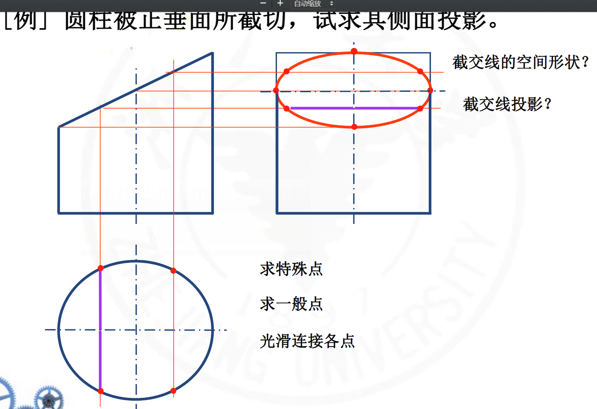
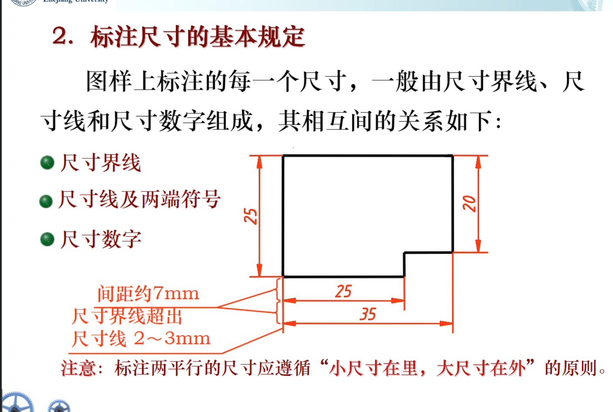
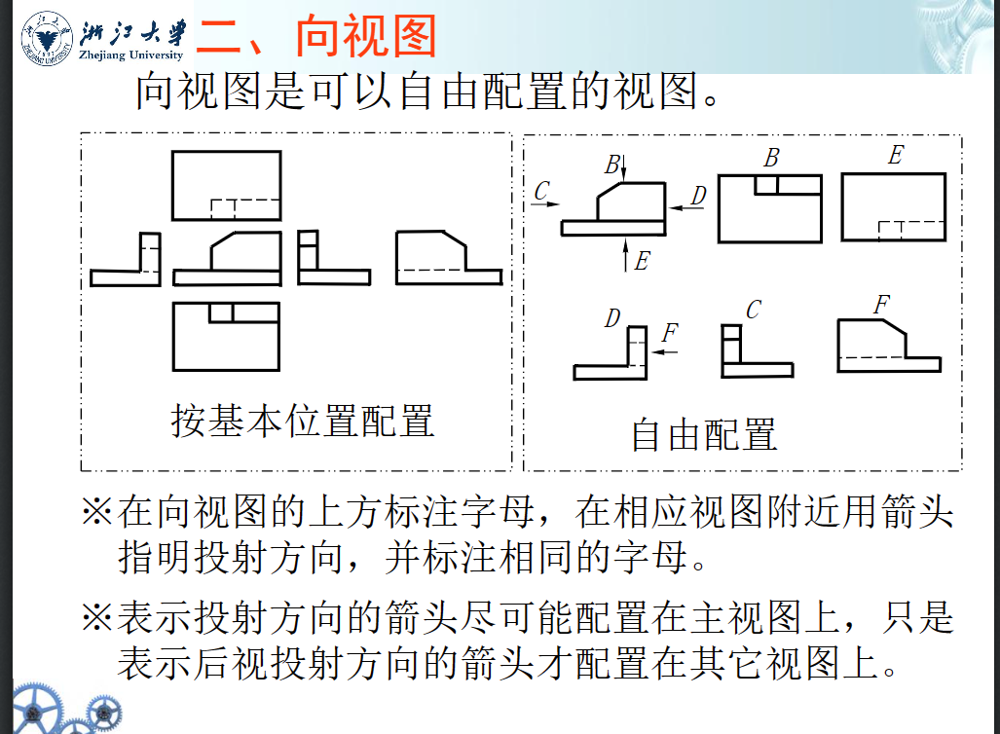
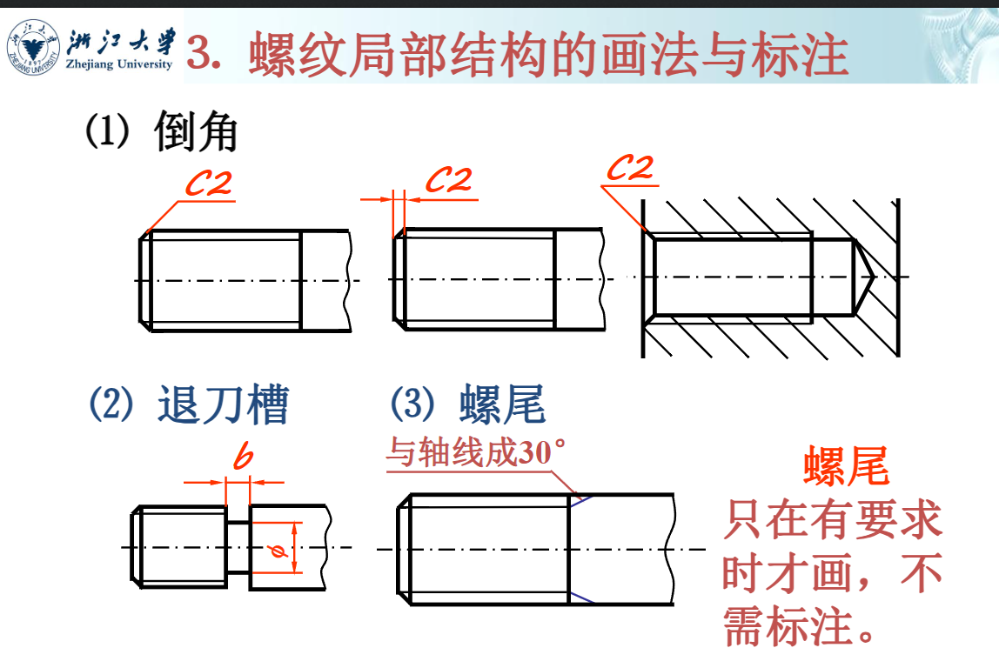
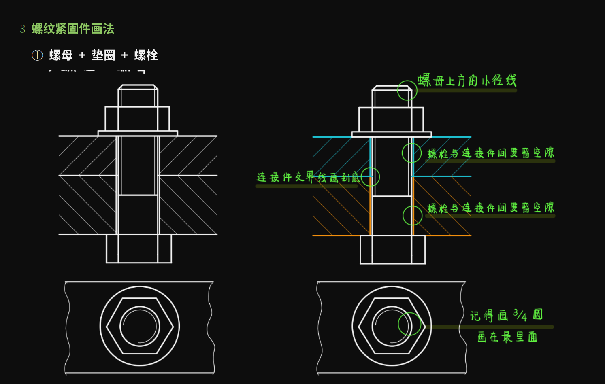

# 投影
## 投影体系的建立
水平投影面——H

正面投影面——V

投影轴——OX

## 点的投影

## 线的投影
注意几条特殊的直线
铅锤，正锤，侧垂
水平，正平，侧平
### 一般位置直线

求直线和面的夹角也是很重要的（主要是考高中立体几何，脑子没抽就不太需要记公式）
**点分割线段，线段长度仍然成比例**
**若点在直线上，则点每一个投影都在直线上**
**两直线的关系:平行，相交，意面**    （~~平行，香蕉，意面~~）

如何判断两个直线的关系？

1.**平行**
对于一般位置直线，两个平面上都有平行的投影的话，可以说明这两条直线平行

对于特殊位置直线则不成立（比如同为水平线，然后水平面投影平行和侧平面平行，但是正平面可以不平行

之所以一般位置平面可以，是因为一般位置直线两条平行之后可以看到第三条一般也会平行

2.**相交**
两直线相交的问题——转化为一个点在直线上的空间投影特征
也就是符合等比定理

3.**判断重影点的可见性**&**求公垂线判断实际长度**
求公垂线先挖掘一下几何性质（什么平行和垂直之类的）
然后把取一个点
然后过这个点做垂线
再找到垂线和直线的交点
然后找到这条直线
最后求出长度（这样描述好抽象）
## 面的投影

迹线表示法

### 面的关系
垂直，平行，倾斜
其中平行和垂直都有积聚性
平行是两条直线
垂直是一条直线两个三角形

**一般位置平面就是三个三角形**

### 平面上取点
平面上取点先找出过此点而又在平面内的一条直线作为辅助线，然后再在该直线上确定点的位置
特殊位置平面用积聚性，一般位置平面就用三角形上的比例关系（过一个顶点，用一个直线穿过这个取的点，然后和对边相交，和对边相交的点以及取的点在各自直线上的等比性质，我们就可以求出这个点在其他投影上的位置
### 已知点和直线，作特殊的平面
利用要做的面的特殊性
我们可以发现这个面的投影特征，然后还有一个重要的性质————**面的迹线在各个坐标轴上相交（或许只看ox就好了）**
## 直线平面相对位置
### 直线和平面平行

高中立体几何：找得到在平面内的一条线和直线平行，那么这条直线和平面平行

小tip：
1.过一个点做一条直线平行一个平面：无数多个解(所形成的解构成一个平面)~~线性代数那味~~
2.平行两个平面的时候，一般就只有一个特解了，要通过具体的关系（很有可能另一个平面也是一个特殊平面）
### 两平面平行
两平面平行
1.若一平面上的两相交直线分别平行于另一平面上的两相交直线，则这两平面相互平行。

2.若两投影面垂直面相互平行，则它们具有积聚性的那组投影必相互平行。

### 两平面相交
这个时候考的是可见性
水平方向的可见性看俯视，离轴远的可见（矮的可见）
竖直方向的可见看主视图，离轴远的可见（高的可见）
## 基本立体投影
没什么好说的，就那么几个
# 立体图形的三视图
## 截交线

平面立体的截交线  基本思想就是对着图然后把直线的套路重复重复再重复
回转体由于出现了圆，那么截交线就比较的难搞了

回转体的截交线都是光滑的曲线
一般通过取点法找特殊点，然后用光滑的曲线连接即可

1.圆柱体

注意看这个侧视图，就是椭圆（高和宽被截平面的角度限制）

2.圆锥

高中解析几何的噩梦
特殊点主要抓**母线**的投影
3.圆
主要注意截过之后
可能会有宽度的减少（因为把直径那个最长的地方截掉了）

最后常考题型也就是这几种题目的一个总结
## 相贯线
相贯：两立体相交称为相贯。

相贯线：相贯立体的表面交线称为相贯线。

相贯线的性质：

1.相贯线是两个立体表面的共有线，相贯线上的点是两个立体表面的共有点；

2.相贯线通常是一封闭的空间曲线（或折线）相贯线的形状取决于：

3.两立体的形状、大小和相对位置。求相贯线就是求出两立体表面的共有点或共有线

比较恶心的是很容易忘记的曲面的相贯线

圆锥和圆柱也会有相贯线，描点法，画出光滑曲线（一定要画，经常忘记）

不是很对称就比较抽象了
（最后ppt的十来页还没看，记得去看）
## 组合体

### 叠加类
1.相接不平齐和相接平齐
相接不平齐的话要在相接处画出直线
2.相切和不相切
相切的话 表面光滑过渡，所以不需要画出交线
而不相切的话不光滑过渡，需要画出交线（回转体和回转体相交会产生相贯线）
### 形体分析和面形分析
一个是分解法，一个是切片法

特殊的相贯线（因为只有上面是圆弧，所以，只有上面有相贯线，很容易直接忽略了相贯线）
### 图线的意义
视图中一个封闭线框一般情况下表示一个面的投影，线框套线框，通常是两个面凹凸不平或者是具有打通的孔。
两个线框相邻，表示两个面高低不平或相交。

# 尺寸标注
## 容易忘的细则
1.以毫米为单位时，不需标注计量单位的代号或名称，若采用其他单位，则必须注明相应的计量单位的代号或名称。
2.机件的每一尺寸，一般只标注一次，并应标注在反映该结构最清晰的图形上

3.尺寸数字应按国标要求书写，且同一张图纸上字高要一致。
4.**线性尺寸的尺寸数字一般应注在尺寸线的上方**，也允许注写在**尺寸线的中断处**，当地位不够时也可以引出标注。
5.尺寸数字不可被任何图线所通过，否则必须将该图线断开
6.方向

7.尺寸线必须与所标注的线段平行
8.尺寸线不能用其他图线代替，一般也不能与其他图线重合或画在其延长线上
9.标注小于或等于半圆时，应在尺寸数字前加注**半径符号“R”。**
当圆弧的**半径过大或在图纸范围内无法标出其圆心位置时，**可采用**折线**的形式标注。
若不需要标出圆弧的圆心位置时，**可只画靠近箭头的一段。**
10.注球面的直径或半径时，应在**符号“φ”或符号“R”前加注符号“S”**。对于**螺钉、铆钉的头部，轴(包括螺杆)的端部以及手柄的端部等**，在不致引起误解的情况下**可省略符号“S”**。

11.不能再截交线上直接注释尺寸

（因为截交线都是生产过程中车铣刨磨切削出来的，误差较大，在这里标注尺寸有不一样的含义。会导致加工难度直线上升**因为要控制切削之后误差在很小的范围内，让这个截交线可以当做基准线**
12.相贯线上也不能直接注释尺寸
13.对称结构的尺寸不能只注一半（这都是保证加工精度的措施，不然另一半没有约束就可以不加工的很精细）

14.标注定位尺寸，**必须在长、宽、高三个方向分别选出尺寸基准**，**每个方向至少有一个尺寸基准**，以便确定各基本立体在各方向上的相对位置
尺寸基准的选择：**通常可选择组合体的底面、重要的端面、对称平面以及回转体的轴线等作为尺寸基准。**

## 尺寸分类

### **定形尺寸：用于确定各基本立体的形状大小。**

### **定位尺寸：用于确定各基本立体之间的相互位置。**

### **总体尺寸：用于确定组合体的总长、总宽和总高。**

## 标注总体尺寸时，需注意以下两点：
## 总体尺寸有时可能就是某形体的定形或定位尺寸，这时不再注出

## 当标注总体尺寸后出现多余尺寸时，需作调整，避免出现封闭尺寸链。

## 回转体不标总高，用r和圆心的高代替

**间接确定便于加工**

尽量集中标注尺寸，便于查找

标注尺寸要排列整齐，同一方向上几个连续尺寸应尽量标注在同一条尺寸线上。

表示与两视图有关的尺寸应尽量标注在两个视图之间（比如宽，高，长等总体尺寸）

标注的步骤

1.确定定位基准

2.标注定位尺寸

3.标注总体尺寸

4.标注定形尺寸

### 补充几个点
1.小尺寸标注在内，大尺寸标注在外，其中，小尺寸就像被大尺寸保住了一样

*避免尺寸界限之间相互干涉*

2.同心圆较多时，直径尺寸不宜集中标注在反映圆的视图上，避免注成辐射形式。

3.虚线处尽量不标尺寸

4.尺寸应尽量注在视图外面，保持视图清晰
# 机件图样的画法
## 三视图到六视图再到向视图

六视图不常考

**向视图相比传统的三视图更加灵活，便于表达一些特殊的零件**
## 局部视图
**1.用带字母的箭头指明要表达的部位和投射方向，并注明视图名称。**（就是AB之类能够对应的标注，~~不是把图形的名字给标注上去~~）

**2.局部视图的范围用波浪线表示。当表示的局部结构是完整的且外轮廓封闭时，波浪线可省略。**

**3.局部视图可按基本视图的配置形式配置，也可按向视图的配置形式配置。**
## 斜视图
斜视图是物体向不平行于基本投影面的平面投射所得的视图。
画斜视图的注意事项：
**1.斜视图通常按投射方向配置和标注。**（还要旋转投影面）

**2.允许将斜视图旋转配置，但需在斜视图上方注明**

**3.斜视图的断裂边界用波浪线或双折线表示**（就是要把这个投影面给包起来）
## 剖视图
内部结构较为复杂时会出现很多的虚线，而剖视图可以解决虚线问题

### 全剖

### 半剖

常用于表示内外部分都需要表示的零件，同时这个零件还具有对称的特点
不对称的部分一定要表达清楚或许直接放弃半剖

半剖视图中间要用点划线而不是粗实线
### 局部剖
灵活但是我用不太来
用于不对称的内外形都要表达时
几个必须用局部剖的情况
1.机件的轮廓线和中间的点划线重合的时候，需要放弃半剖采用局部剖
2.实心杆有槽时，需要采用局部剖
3.波浪线不能穿空而过，也不能超出机件的轮廓
4.被剖结构为回转体时，适合将虚线用于作为局部剖的分界线
### 断面图
假想用剖切面将物体的某处切断，只画出该剖切面与物体接触部分（剖面区域）的图形

相交的剖切面可以断开，但是一个剖切面的话，就必须是封闭图形不能断开

关于移出断面的标注

如果实在剖切平面的延长线的话不需要标注，但是如果不在延长线上的话，需要我们自己标注A-A这样的标注（和局部视图一个道理）

***重合断面图***

我还没遇到过，希望不会遇到这么古怪的断面图

## 规定画法和简化画法

### 特殊的肋板

### 特殊的杆子

### 对称的零件

### 回转体的小平面

### 七七八八一堆杂的知识

## 第三角画法

# 常用标准件
## 螺纹
### 螺纹的结构

1.**末端：**
倒角，平顶，圆顶(球面)

2.**螺尾和退刀槽**

3.**牙型**
三角形，梯形，锯齿型
### 汏径 小径 中径（内螺纹和外螺纹沟槽和凸起宽度相等的地方）
### 螺纹线数（单线和多线）

### 牙程和导程

中径线上对应两点之间的轴向距离成为螺距 P

同一条螺纹在相邻两牙上的对应两点之间的轴向距离成为导程Ph

### 纹向

右旋不标注，左旋标注LH

### 螺纹的种类

普通（不管粗牙细牙）都是M

管螺纹G

梯形螺纹Tr

锯齿形B

### 螺纹的画法
牙顶：粗实线
牙底：细实线
（牙底的细实线只用画3/4圈）
螺纹终止线用粗实线表示 收尾的时候 螺纹的牙底部分与轴线成30°

### 螺纹局部画法

## 螺纹紧固件的画法

弹簧垫圈是斜45度
135度

螺柱连接两个板子，上面的光孔要大一点

常见工艺结构（铸造
铸造圆角，拔模斜度，壁厚均匀 
机械加工
倒角 退刀槽和砂轮越程槽，钻孔端面，凸台和凹坑

表面粗糙度

孔的标注

