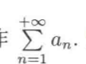
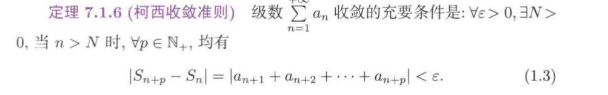
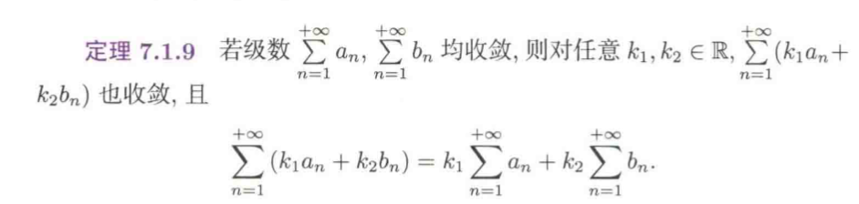
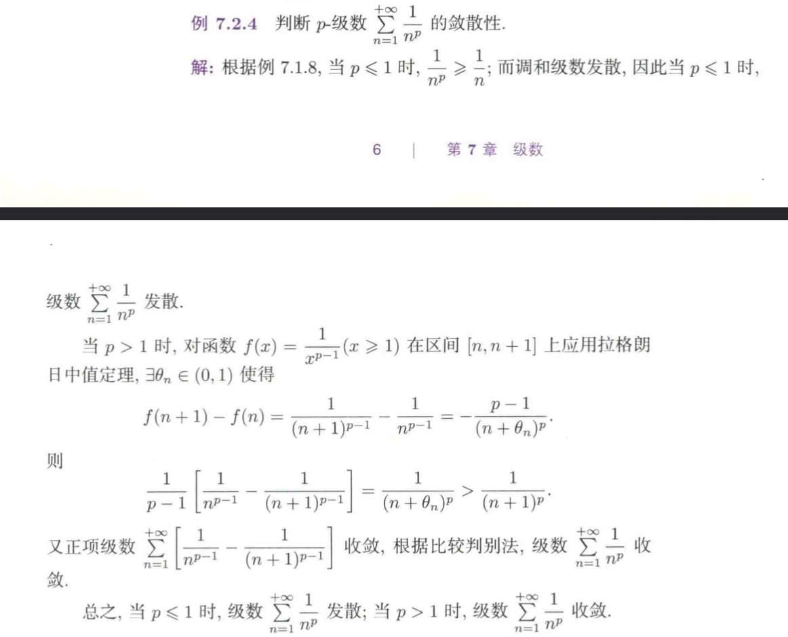
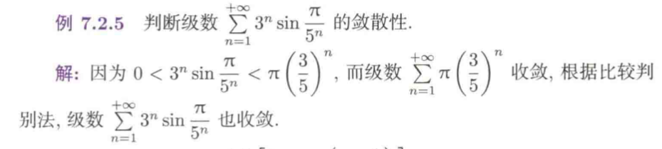

# 微积分2

## 级数

### 级数的收敛性及基本性质

1.无穷级数：给定无数个数an，其和式a1+a2+...+an+...
记作

这只是一个形式的记号，不一定有明确的含义，也就是不一定有明确的“和”

2.常数项级数：若an都是常数，则级数也称为常数项级数，简称为级数，其中第n项an叫做*通项*或者*一般项*

3.其中Sn为从a1+....+an的一个数列

4.数列的收敛：

若Sn发散，则an的无穷级数发散

5.柯西收敛准则：

1+1/2+1/3+1/4+......+1/n+......称为调和级数（发散）

证明思路：1/(n+1)+1/(n+2)+......+1/(n+n)>n/(n+n)=1/2
取极小值为1/2即可证明发散

6.基本性质：
两个级数均收敛，此时这两个级数的任意线性组合均为收敛的级数!

去掉，添加，改变有限项级数，不改变收敛性
rn=S-Sn，rn为级数的余项（误差）

收敛级数添加任意括号后所得的级数仍然收敛，且其和不变

事实上，若原级数收敛，添加括号所得的级数1，其部分和数列Tn和原级数部分和数列Sn的子列都是收敛的(收敛级数的任何子数列都是收敛的)

发散数列添加括号之后可能收敛
(1-1+1-1+1+.....+1-1+.....)变成(1-1)+(1-1)+(1-1)+......+(1-1)+......

### 正向级数

#### 正向级数的一般判定法则

每一项为正数的级数为正向级数，Sn单调递增

正向级数收敛的充分必要条件是部分和数列Sn有界，存在正数M>0，对任意n
都有 Sn=级数 <= M
级数收敛是由其部分和数列是否存在极限来判断的，但是确定Sn具体的值却是一件难事

#### 正向级数的比较判别法

1.比较判别法：引入一个已知收敛性质的正项级数1，
若n>N时，有an<=bn,那么bn对应级数收敛，an也收敛
若an发散，则bn必定发散
2.极限判别法：
lim an/bn=l
(1)l为实数，则an与bn有相同的收敛性
(2)若l=0，若b收敛，则an收敛（an发散，bn发散）
(3)l=正无穷，bn发散，a发散
**具体做题的时候可以采用微积分1中各种知识**

