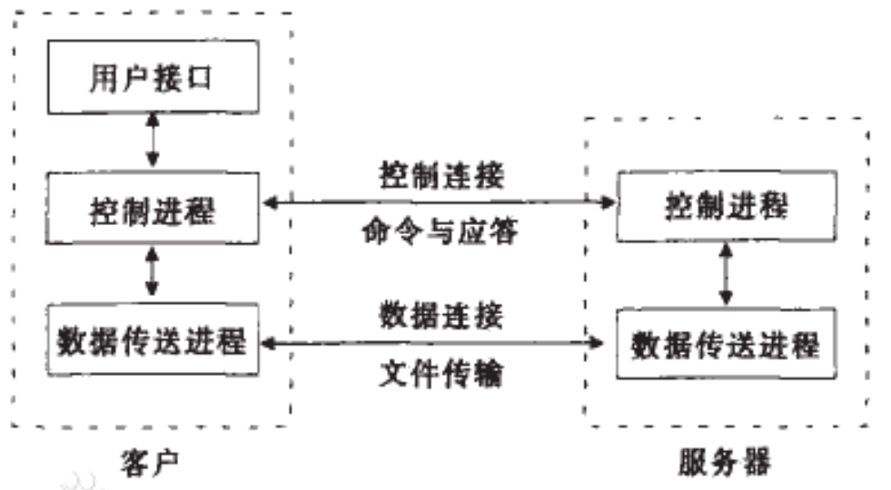

# 计算机网络

- 广域网：WAN
- 城域网：MAN
- 局域网：LAN
- 个人局域网；PAN

## 计算机网络体系

先来几个名词

- DNS:域名系统
- HTTP/HTTPS：网页开头
- WWW：万维网
- FTP：用于在网络上进行文件传输的一套标准协议
- DHCP：自动获取ip地址
- IP：网络地址
- VPN：天天用

协议：网络协议是通信计算机双方必须共同遵从的一组约定，如怎么样建立连接、怎么样互相识别等。
只有遵守这个约定，计算机之间才能相互通信交流

### 传输层协议：TCP/UDP

TCP/IP（Transmission Control Protocol / Internet Protocol，传输控制协议 / 网际协议）是指能够在多个不同网络间实现信息传输的协议簇

- **挖坑：记得看视频学习这方面的知识**

### 超文本传输协议（（安全协议））

- HTTPS：Hypertext Transfer Protocol over Secure Socket Layer，基于SSL（安全套接层）的 HTTP 协议）。

- HTTP 协议
以明文方式发送内容，不提供任何方式的数据加密，如果攻击者截取了 Web 浏览器和网站服务器之间的传输报文，就可以直接读懂其中的信息，因此，HTTP 协议不适合传输一些敏感信息，比如：信用卡号、密码等支付信息。

为了解决 HTTP 协议的这一缺陷，需要使用另一种协议：HTTPS，为了数据传输的安全，HTTPS 在 HTTP 的基础上加入了 SSL 协议，SSL 依靠证书来验证服务器的身份，并为浏览器和服务器之间的通信加密。

### FTP

file transfer protocol（文件传输协议）
用来在网络上进行文件传输的一套标准协议，相比于http协议，ftp更加专心于文件传输

常用来：下载课程作业/软件

可以让我们访问特定远程服务器上的特定文件，并且进行新建，删除，编辑，查询文件等各种功能。我们可以通过FTP管理目录，查看电子邮件

FTP可以做到在不同的操作系统和文件传输方式之间实现双向的文件传输。

能够搭建一个在任意环境都能使用的网盘，还可以实现双向的问价传输。

- **如何使用**
日常的windows其实已经内置了FTP支持，但是功能有限，且文件编码存在一定的兼容性问题。
推荐使用;FileZilla软件

- 挖坑+1；之后访问这一篇推文了解如何使用ftp
https://mp.weixin.qq.com/s/9Dod5nR68pDy3M65wazrug

### cookie：保存在客户机中的简单的文本文件

这个文件和特定的网页关联在一起，当客户机访问这个网址的时候这些信息可供网页使用

存在一定的安全隐患

### 常见错误请求

200 OK//客户端秦秋成功
400 Bad Request//客户端请求有语法错误，不被服务器理解
403 Forbiddden// 服务器拒绝提供服务
404 Not Found//请求资源不存在，比如输入了错误的URL
500 Internal Server Error//服务器发生不可预知的错误
503 SERVER Unavaliable// 服务器当前不能处理请求，一段时间后可能恢复

HTTP Cats
301 永久移动。被请求的资源已被永久移动位置；
302 请求的资源现在临时从不同的 URL 响应请求；
305 使用代理。资源须通过指定的代理访问；
307 临时跳转。资源临时从不同的URL响应请求；
400 错误请求；
402 需要付款。该状态码是预留的，用于一些数字货币或者是微支付；
403 禁止访问。服务器理解请求，但是拒绝执行；
404 找不到对象。请求失败，资源不存在；
406 不可接受的。请求的资源的内容特性无法满足请求头中的条件，因而无法生成响应实体
https://http.cat/
硬件茶谈的视频：https://www.bilibili.com/video/BV1DD4y127r4/

### ip地址

- IPv4——32 位的标识符
A 类地址——常用于大型网络
前 8 位——网络号
后 24 位——主机号
网络号范围 0.0.0.0~127.0.0.0
地址范围 0.0.0.0~127.255.255.255
一个网络号下可分配的主机数：224-2

- IPv6：一个比 IPv4 神奇的东西，其数量超过地球上的沙子。
目的是应对 IPv4 资源越来越少这个问题。
优点：更大的地址空间、改进的选项、允许协议继续扩充、支持即插即用（自动分配）……
IPv6 那么好用为什么还没有普及？
——综合铺设成本、市场需求以及其他一些方面的因素
（线路改造花费太多，运营商暂时不想投入）
不过目前的比较重要的、比如 DNS 的根服务器，已经升级成了 IPv6

### mac地址

MAC 地址也叫物理地址、硬件地址，由网络设备制造商生产时烧录在网卡（Network Interface Card）的 EPROM（一种闪存芯片，通常可以通过程序擦写）。IP 地址与 MAC 地址在计算机里都是以二进制表示的，IP 地址是 32 位的，而  MAC 地址则是 48 位的。
MAC 地址的长度为 48 位（6 个字节），通常表示为 12 个 16 进制数，如 00-16-EA-AE-3C-40 就是一个 MAC 地址，其中前 3 个字节，16 进制数 00-16-EA 代表网络硬件制造商的编号，它由 IEEE（电气与电子工程师协会）分配，而后 3 个字节，16 进制数 AE-3C-40 代表该制造商所制造的某个网络产品（如网卡）的系列号。只要不更改自己的 MAC 地址，MAC地址在世界是唯一的。形象地说，MAC 地址就如同身份证上的身份证号码，具有唯一性。

### DNS域名解析服务器
